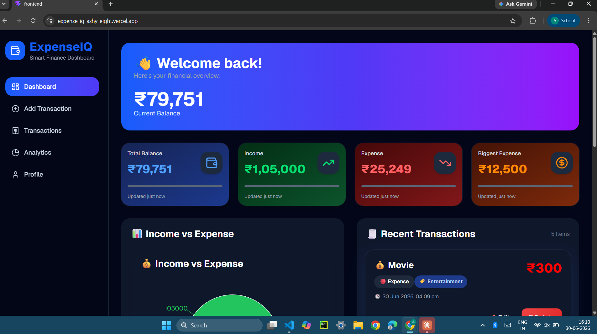
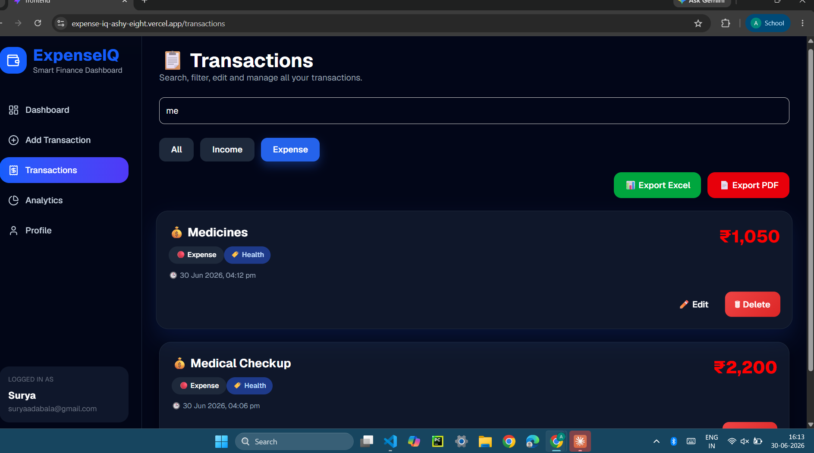
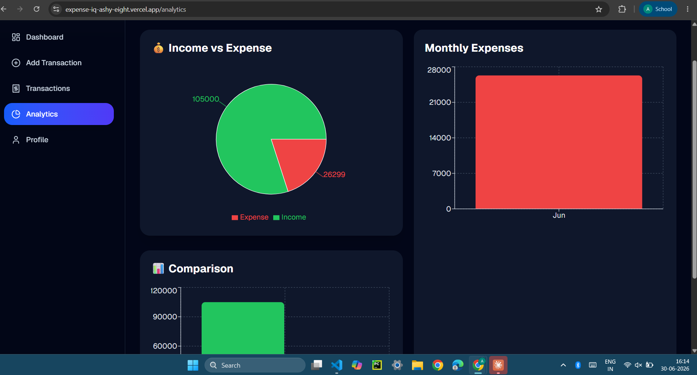
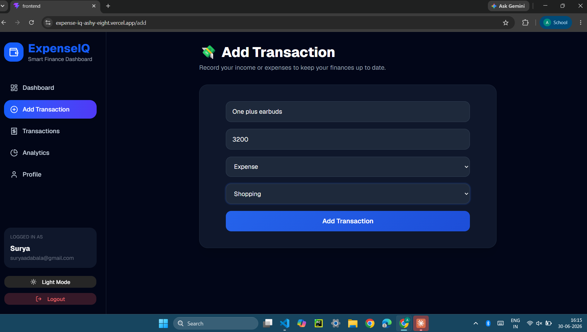
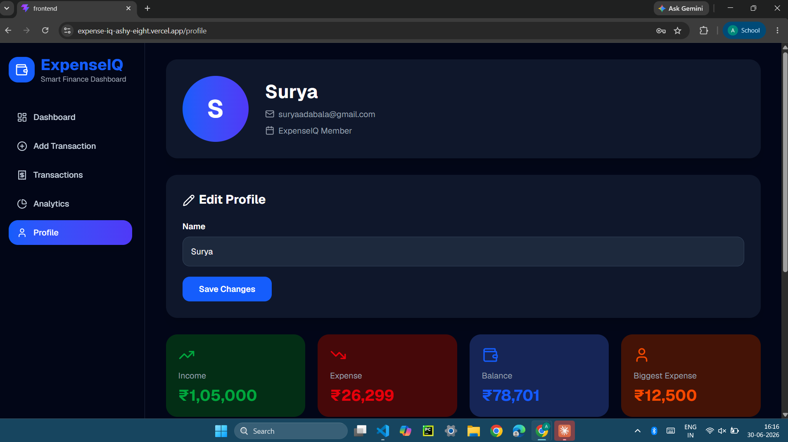
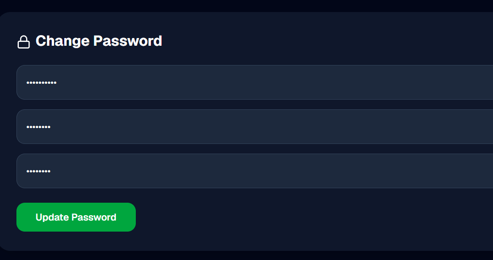
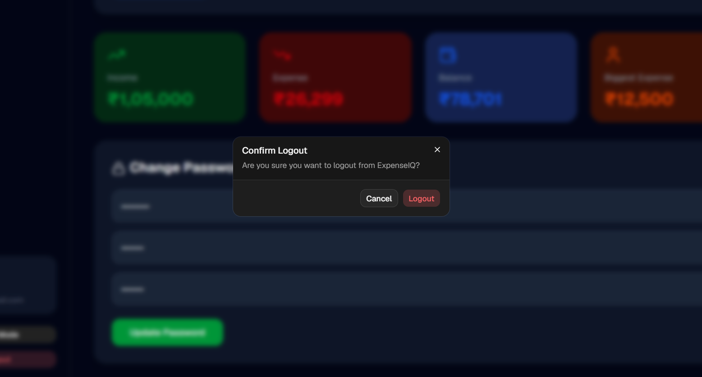

# 💰 ExpenseIQ

A modern Full Stack Expense Tracker built using the MERN Stack with JWT Authentication, Analytics, PDF/Excel Export, Dark Mode and Responsive UI.

---

## 🚀 Live Demo

🌐 Frontend:
https://expense-iq-ashy-eight.vercel.app

⚙ Backend:
https://expenseiq-3uvv.onrender.com

---

## ✨ Features

- 🔐 JWT Authentication
- 👤 User Registration & Login
- ✏ Update Profile
- 🔑 Change Password
- 💸 Add Income & Expenses
- 📋 Transaction Management
- 📊 Dashboard Analytics
- 📈 Charts using Recharts
- 🌙 Dark Mode
- 🔍 Search Transactions
- 🎯 Filter Transactions
- 📄 Export to PDF
- 📊 Export to Excel
- 📱 Responsive UI
- ☁ MongoDB Atlas
- 🚀 Deployed using Vercel & Render

---

## 🛠 Tech Stack

### Frontend

- React
- Vite
- Tailwind CSS
- Shadcn UI
- Framer Motion
- Axios
- Recharts
- Sonner

### Backend

- Node.js
- Express.js
- MongoDB
- Mongoose
- JWT
- bcrypt

---

## 📂 Folder Structure

```
ExpenseIQ

frontend/

backend/

README.md
```

---

## ⚡ Installation

Clone the repository

```bash
git clone https://github.com/varaprasad476/ExpenseIQ.git
```

Frontend

```bash
cd frontend
npm install
npm run dev
```

Backend

```bash
cd backend
npm install
npm run dev
```

---

## 📷 Screenshots

### 📊 Dashboard



Get a complete overview of your finances with balance, income, expenses, biggest expense and recent transactions.

---

### 💳 Transactions



Search, filter, edit, delete and export transactions as PDF or Excel.

---

### 📈 Analytics



Interactive charts showing income vs expense and monthly spending.

---

### ➕ Add Transaction



Quickly add categorized income and expense transactions.

---

### 👤 Profile



Manage your profile, change your name and monitor your financial summary.

---

### 🔒 Change Password



Securely update your account password.

---

### 🚪 Logout Confirmation



Confirmation dialog before logging out.